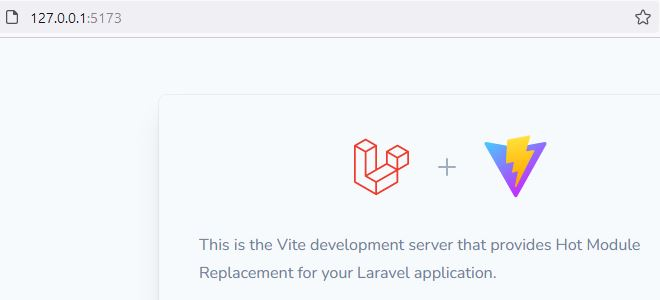
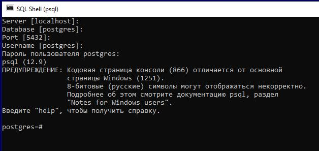
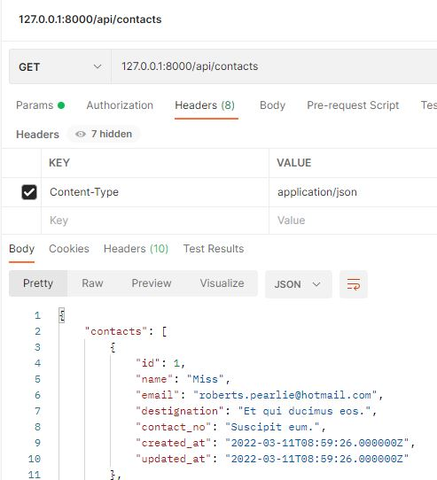
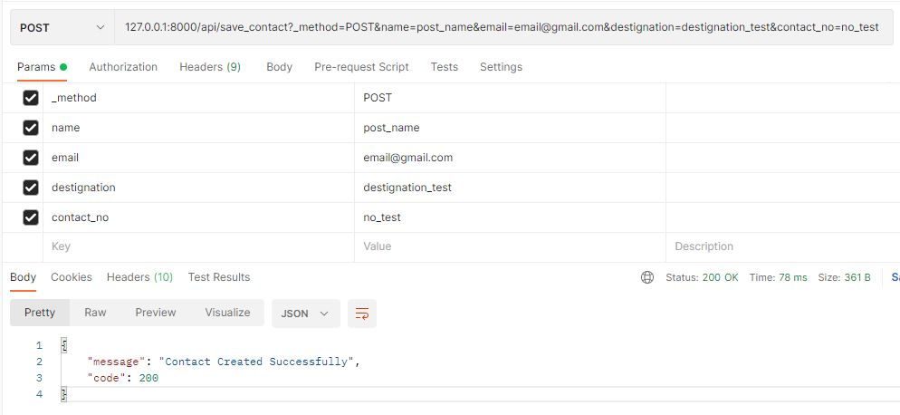
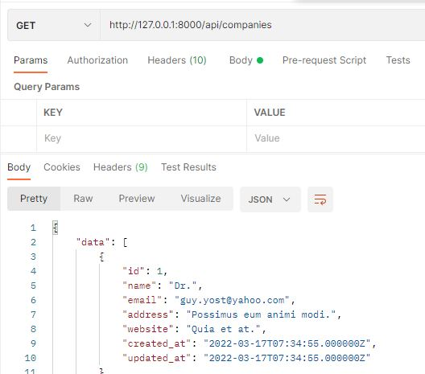

## Main stages of development

#### 1. Installation Project Template. Create Database

`composer create-project --prefer-dist  laravel/laravel .`   
`npm install`  
`npm run dev`  
```
 npm run dev  
 VITE v3.0.7  ready in 380 ms

  ➜  Local:   http://127.0.0.1:5173/
  ➜  Network: use --host to expose

  LARAVEL v9.24.0  plugin v0.5.3
```
     


`git init`  
`git add .`  
`git commit –m "Comment"`  
**`git remote add origin https://github.com/SergeyHub/laravel_crud_api_vue_back.git`**  
`git push -u origin master`  

##### 1.1 Postgersql
```
Let's start SQL Shell (psql). The program will prompt you to enter the name    
of the server, database, port and user. You can click/skip these items as they  
will use the default values   
(for server - localhost, for database - postgres, for port - 5432,  
as user - postres superuser). 
Next, you will need to enter a password for the user   
(by default, the postgres user): 123456 (in my case)  
```

   

`postgres=# create database db_name;`  
  **database list**  
`select datname from pg_database;`   
pg_dump dbname > outfile 

**`Edit  env. file`**    
```
DB_CONNECTION=pgsql
DB_HOST=localhost
DB_PORT=5432
DB_DATABASE=cargo
DB_USERNAME=postgres
DB_PASSWORD=123456
```
##### 1.2 MySQL

`mysql -u root -p`  
`create database crud_api; db_name;`  
`drop database db_name;`   
`show databases;`  
`use db_name;`  
`show tables;`   
`drop table table_name;`  
`exit`  

**`Edit  env. file`**   
```
DB_CONNECTION=mysql
DB_HOST=127.0.0.1
DB_PORT=3306
DB_DATABASE=crud_api
DB_USERNAME=root
DB_PASSWORD=123456
```
##### 2 Posts model
`php artisan make:model Posts -m`  

##### 2.1 2022_10_02_022607_create_posts_table.php
```
 $table->string('name');
 $table->longText('description');           
 $table->string('image')->nullable();
```
`php artisan migrate`  

##### 2.2.

`git log`  
`git add .`  
**`git commit -m "Connect to Mysql Create Posts model & migration"`**   
`git push -u origin master`  

#### 3 Add fieldes as fillable variables in the Posts Model
```
    protected $fillable = [
        'name',
        'description',
        'image'
    ];
```
##### 1.4 Version
`npm -v`  
`php -v`

#### 2. ContactController Contact Model Table & api route
`php artisan make:controller ContactController`    
`php artisan make:model Contact -m`    
`php artisan migrate`  

#### 3. Table Contact : Seeding
`php artisan make:factory ContactFactory`  
```
return [
    'name' => $this->faker->title(15),
    'email' => $this->faker->email,
    'destignation' => $this->faker->text(25),
    'contact_no' => $this->faker->text(15),
];
```
`php artisan make:seeder ContactSeeder`  
```
Contact::factory()->count(25)->create();
```
`php artisan db:seed --class=ContactSeeder`  

 

#### ContactController saveContact Method  
Create the POST API to insert data in database.   
Test  POST API with postman  

```
        $contact = new Contact();
        $contact->name = $request->name;
        $contact->email = $request->email;
        $contact->destignation = $request->destignation;
        $contact->contact_no = $request->contact_no;

        $contact->save();
        return response()->json([
            'message' => 'Contact Created Successfully',
            'code' => 200

        ]);
```
```
Route::get('contacts', [ContactController::class, 'contacts']);
Route::post('save_contact', [ContactController::class, 'saveContact']);
```
 

#### ContactController deleteContact Method  
#### Staff Controller Model Table

#### npm install vue@next vue-router@next vue-loader@next
`npm install vue@next`  
`npm install vue-router@next`  
`npm install vue-loader@next`  
**webpack**
add .vue()
```
mix.js('resources/js/app.js', 'public/js').vue().postCss('resources/css/app.css',
    'public/css', [
    require('postcss-import'),
    require('tailwindcss'),
    require('autoprefixer'),
]);
```

#### composer require laravel/breeze php artisan breeze:install
`composer require laravel/breeze`   
`php artisan breeze:install`  
`php artisan migrate --seed`

#### php artisan make:model Company -m php artisan make:controller Api/CompanyController --api --resource --model=Company
`php artisan make:model Company -m`  
`php artisan make:controller Api/CompanyController --api --resource --model=Company`  

#### php artisan make:resource CompanyResource php artisan make:request CompanyRequest
`php artisan make:resource CompanyResource`  
`php artisan make:request CompanyRequest`  
#### Company Controller Resource Request php artisan migrate
#### Table Company Seeding
`php artisan make:factory CompanyFactory`  
`php artisan make:seeder CompanySeeder`  
`php artisan db:seed`  
#### Test Api Postman
 
